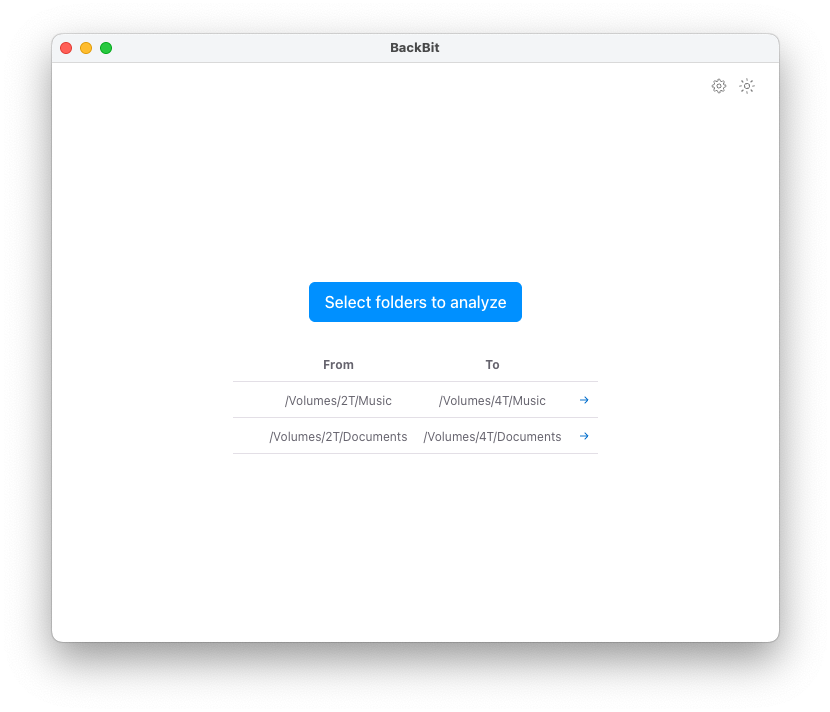
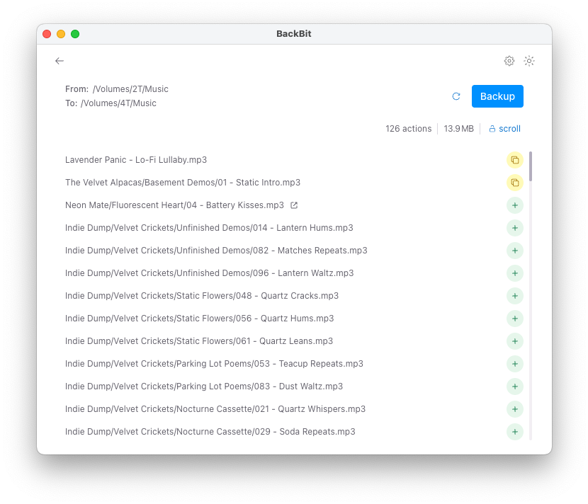

# BackBit  
[](LICENSE)

Minimalist backup tool for mirroring a source folder to its destination. Compares files by size and modified time.

Inspired by *Syncronize It!*, the only Windows app I kept missing after moving to macOS.




## Features

- Cross-platform (Windows, macOS, Linux)
- Graphical interface (Electron-based)
- Preview changes before running
- Compare files by size and modified time
- Show progress and completion status

## Download
Grab the latest release for your OS from the [Releases](../../releases) page.

## Usage

1. Open BackBit
2. Select source and destination folders
3. Review the list of changes
4. Click **Run** to sync destination with source

## Development

### Install

```bash
$ npm install
```

### Run in dev mode

```bash
$ npm run dev
```

If on Linux, you may need to previously run
```bash
$ sudo chown root:root node_modules/electron/dist/chrome-sandbox
$ sudo chmod 4755 node_modules/electron/dist/chrome-sandbox
```

### Generating testing folders

```bash
$ npm run tests:many
```

### Build

```bash
# For windows
$ npm run build:win

# For macOS
$ npm run build:mac

# For Linux
$ npm run build:linux
```

## License

This project is licensed under the GNU General Public License v3.0 - see the [LICENSE](LICENSE) file for details.

### GPL v3 Summary

This program is free software: you can redistribute it and/or modify it under the terms of the GNU General Public License as published by the Free Software Foundation, either version 3 of the License, or (at your option) any later version.

This program is distributed in the hope that it will be useful, but WITHOUT ANY WARRANTY; without even the implied warranty of MERCHANTABILITY or FITNESS FOR A PARTICULAR PURPOSE. See the GNU General Public License for more details.
